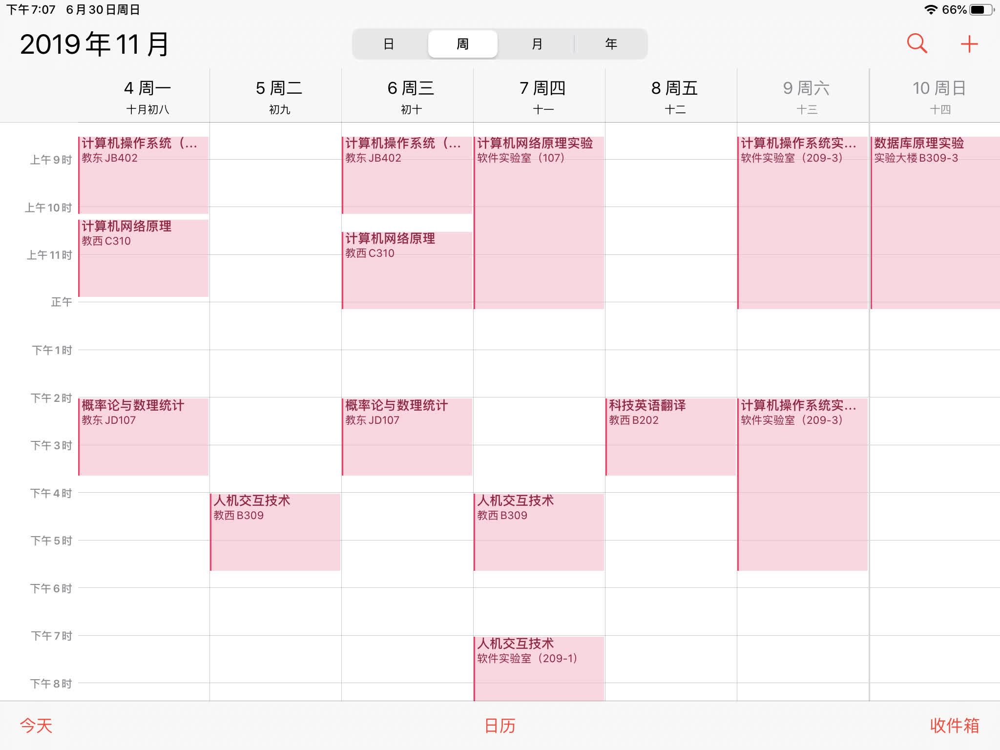

### 总述

- 对于 **西北工业大学** 的学生

  你可以运行 `GetClass.py` 脚本以从教务系统爬去你的课程信息

- 对于其他学校的学生

  你需要修改`settings/classInfo.json`和`settings/ClassTimeSetting.json`

  或修改`settings/classInfo.xlsx`和`settings/ClassTimeSetting.xlsx`

  当你修改xlsx文件后, 需要运行`ReadExcel.py`来生成所需要的配置文件


- 对于所有人

  当你获取到所有的信息后运行`classTable.py`生成一个名为`res.ics`的日历文件，导入你的日历应用

效果图



### 配置文件的格式

- settings/ClassTimeSetting.json

  ```json
  [
      {
          "name": "第几节课，这里就是几",
          "during": "这节课的时长是多少",
          "offset": "这节课和上节课的结束时间差多少分钟，即课间时长",
          "time": {
              "start": "这节课的开始时间，格式为hhmm"
          }
      },
      ...
  ]
  ```

  **NOET**:
  - 如果不写`offset`字段，就必须写`time`字段，反之亦然
  - 请按顺序写
  - 第一节课必须写`time`字段
  - 除了`offset`和`time`字段外，其余字段必写


- settings/classInfo.json

  ```json
  [
      {
          "name": "这节课的名字",
          "week": {
              "start": "这节课开课周",
              "end": "这节课结课周"
          },
          "day": "这节课周几上，例如周日是7，周一是1",
          "time": {
              "start": "这节课是第几节课",
              "end": "到第几节课"
          },
          "room": "教室"
      },
      ...
  ]
  ```

  - 其中`time`字段的`start`和`end`配合上述`ClassTimeSetting.json`使用

- 两个表格
